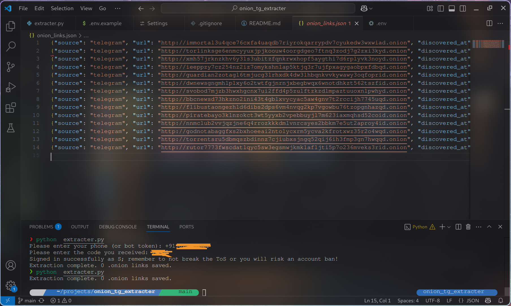

#  Telegram Onion Link Scraper

A Python-based asynchronous script that scans a Telegram channel for `.onion` links (Dark Web URLs) and saves them to a JSON file for further analysis.

---

## 🔍 Overview

This tool leverages the **Telethon** library to interact with Telegram and extract `.onion` URLs from messages in a specified public channel. It stores the results in a newline-delimited JSON file and ensures no duplication by keeping track of the last scanned message ID.

---

## ⚙️ Features

- ✅ Extracts `.onion` links from Telegram channels  
- 🔁 Skips previously scanned messages using `last_message_id.txt`  
- 📄 Saves results in a structured JSON format (one object per line)  
- 🕒 Timestamps each link with UTC discovery time  
- 🚧 Marks new links as `status: pending` for further processing  
- 🔒 Uses environment variables for secure API key handling  
- 🔄 Automatically handles Telegram rate limits (basic support for `FloodWaitError`)
- Used black for code formatting.
---

## 📁 File Structure

```
telegram-onion-scraper/
├── .env                   # Contains API credentials
├── last_message_id.txt    # Stores the last scanned Telegram message ID
├── onion_links.json       # Output file with extracted .onion links
├── extracter.py              # Main script
└── README.md              # Documentation
```

---

## 📦 Requirements

- Python 3.7+
- `telethon`
- `python-dotenv`

Install the dependencies with:

```bash
pip install -r requirements.txt
```

Create a `requirements.txt` file with the following content:

```
telethon
python-dotenv
```

---

## 🔐 Environment Variables

Create a `.env` file in the root directory with the content of .env.example.

> You can obtain your API ID and Hash from [https://my.telegram.org](https://my.telegram.org).

---

## 🚀 Usage

1. Clone the repository:

```bash
git clone https://github.com/yourusername/telegram-onion-scraper.git
cd onion_tg_extracter
```

2. Set up your `.env` file as described above.

3. Run the script:

```bash
python extracter.py
```

The script will connect to the specified Telegram channel, ask for your credentials and extract `.onion` links into `onion_links.json`.
> Make sure to use the phone number in international format.
---

## 📦 Output Format

Each line in `onion_links.json` is a separate JSON object with the following structure:

```json
{
  "source": "telegram",
  "url": "http://exampleonionlink.onion",
  "discovered_at": "2025-05-16T10:23:15.000Z",
  "context": "Found in Telegram channel @toronionlinks",
  "status": "pending"
}
```

---
## Screenshot
Screenshot of the tool-
